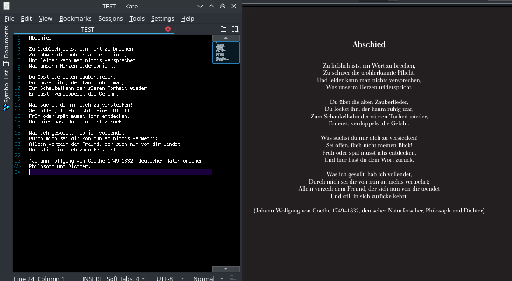

# PrettyPoem



PrettyPoem is a small tool written in C++ that generates a PDFLaTeX file out of a text file.

This PDFLaTeX file can have attributes (such as text color, background color, font, text justification, font) that are chosen at random.

Thus, every PDFLaTeX document you generate with PrettyPoem is different from the last document you generated with PrettyPoem.

# Build Program
Simply type "make" in the CLI of the project folder.

This also generates a new folder "settings" that contains the files "fonts" (empty) and "colors" (with some preset colors)

# Run Program

<code>"./PrettyPoem [text file] [optional: name of latex output file]"</code>

Note: The first line in your text file will be automatically parsed as the "title" of your document.

# Custom Fonts & Colors

You can add custon fonts and color combinations to the randomization roulette of PrettyPoem.

The "colors" file contains pairs of colors each line. The first color denotes the document background color, the second color denotes the text color. As of now, only the standard xcolor dvips names are accepted which you can read about [here](https://en.wikibooks.org/wiki/LaTeX/Colors#The_68_standard_colors_known_to_dvips).

The "fonts" file, after a fresh install, is empty. In this file, you can add font package inclusions from which one will be inserted into the generated LaTeX file.

A custom "fonts" file, for example, could look like this:

```latex
\usepackage[sfdefault]{universalis}
\usepackage[sfdefaultcondensed]{roboto}
\usepackage{accanthis}
\usepackage[sfdefault]{AlegreyaSans}
\usepackage{arev}
\usepackage{aurical}
\usepackage{calligra}
\usepackage[sfdefault]{merriweather}
\renewcommand*\sfdefault{ugq}
\usepackage[sfdefault]{roboto}
\usepackage{antiqua}
\usepackage{antpolt}
```

etc.

# LaTeX Package Dependencies

PrettyPoem depends on the following packages:

* article
* geometry
* fontenc
* inputenc
* xcolor
* your custom font packages...
